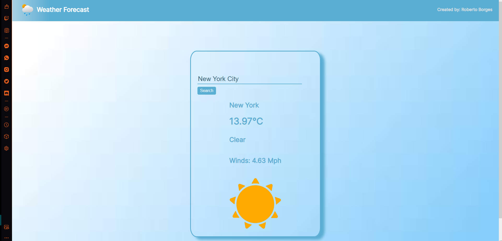

# Weather Forecast Application

Welcome to my Weather Forecast Application! This application provides real-time weather information for different cities around the world. You can search for a city and retrieve its name, temperature in Celsius, and whether it is cloudy or sunny.

## Screenshots

## Features

- Search for weather forecasts by city name.
- Retrieve the name, temperature in Celsius, and weather condition (cloudy or sunny) for the specified city.
- Responsive design for seamless user experience on different devices.

## Installation

To use the Weather Forecast Application, follow these steps:

1. Clone the repository: `git clone https://github.com/ItsRobertoBorges/weather-forecast.git`
2. Open the project in your preferred code editor.
3. Install the necessary dependencies: `npm install`
4. Start the application: `npm start`

## Usage

1. Launch the application in your web browser.
2. Enter the desired city name in the search bar.
3. Click the "Search" button to retrieve the weather forecast.
4. View the city name, temperature in Celsius, and weather condition displayed on the screen.
5. Explore additional features and functionalities.

## Contributing

Contributions are welcome! If you have any ideas, suggestions, or bug fixes, please submit a pull request. For major changes, please open an issue first to discuss the proposed changes.

## License

This project is licensed under the [MIT License](LICENSE).

## Contact

For any inquiries or feedback, feel free to contact me at robbyborges98@outlook.com.
